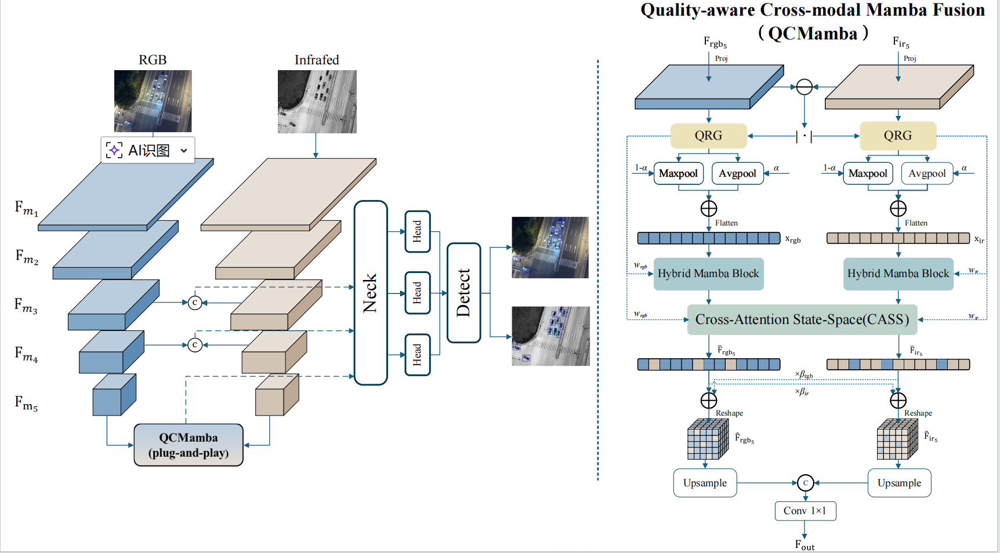

# QCMamba: Quality-Aware Cross-Modal Mamba-Attention Fusion for RGB-Infrared Object Detection

<p align="left">
  <a href="#empty"></a>
  <a href="#empty"></a>
  <a href="#empty"></a>
  <a href="URL_TO_YOUR_PAPER"></a>
</p>

This is the official PyTorch implementation of the paper **"QCMamba: Quality-Aware Cross-Modal Mamba-Attention Fusion for RGB-Infrared Object Detection"**.

## 📢 News
* **[Coming Soon]** The complete PyTorch training code, configuration files, and pre-trained weights will be released here upon paper acceptance (or very soon after code cleanup). Please **Watch** and **Star** this repository for updates! 

---

## 💡 Overview

Multispectral object detection combining RGB and Infrared (IR) imagery is crucial for robust perception. However, indiscriminate integration of cross-modal features often introduces significant noise when one modality is degraded (e.g., RGB in low light, IR in fog). 

To address this, we propose **QCMamba**, a plug-and-play fusion module integrated into a dual-stream YOLO backbone. It establishes a **cascaded quality-guidance framework** to dynamically assess modality reliability and seamlessly aligns cross-modal features with linear complexity.

<p align="center">
  
  <br>
  <em>Overall architecture of the proposed dual-stream multispectral detection framework with QCMamba fusion.</em>
</p>

### ✨ Key Features
- **Plug-and-Play Generalizability:** Easily integrates into multiple YOLO generations (**YOLOv5s to YOLOv11s**), consistently improving detection performance (+2.8% mAP50 on YOLOv8s).
- **Quality-Aware Residual Gating (QRG):** Dynamically assesses per-position modality reliability and suppresses noise from degraded modalities at the source.
- **Multi-Scale Scan (MS-Scan):** Combines 6-directional state-space scanning with heterogeneous depthwise convolutions to capture both long-range dependencies and fine-grained local patterns.
- **Cross-Attention State-Space (CASS):** Synergizes the precise spatial alignment of Cross-Attention with the efficient long-range propagation of Mamba.

---

## 📊 Model Zoo & Results

We provide pre-trained weights for our models across three major multispectral benchmarks. All models are based on the **YOLOv8s** backbone equipped with our **QCMamba** module.

### 1. DroneVehicle Dataset
| Model | Params (M) | GFLOPs | mAP@0.5 (%) | mAP@0.5:0.95 (%) | Weights |
|:---:|:---:|:---:|:---:|:---:|:---:|
| QCMamba-YOLOv8s | 19.22 | 90.17 | **86.3** | **65.0** | [Google Drive](#) / [Baidu Disk](#) |

### 2. M3FD Dataset
| Model | Params (M) | mAP@0.5 (%) | mAP@0.5:0.95 (%) | Weights |
|:---:|:---:|:---:|:---:|:---:|
| QCMamba-YOLOv8s | 19.22 | **86.6** | **60.3** | [Google Drive](#) / [Baidu Disk](#) |

### 3. LLVIP Dataset
| Model | Params (M) | mAP@0.5 (%) | mAP@0.75 (%) | Weights |
|:---:|:---:|:---:|:---:|:---:|
| QCMamba-YOLOv8s | 19.22 | **97.5** | **78.4** | [Google Drive](#) / [Baidu Disk](#) |

---

## 🛠️ Installation

**1. Create a conda environment:**
```bash
conda create -n qcmamba python=3.8 -y
conda activate qcmamba
