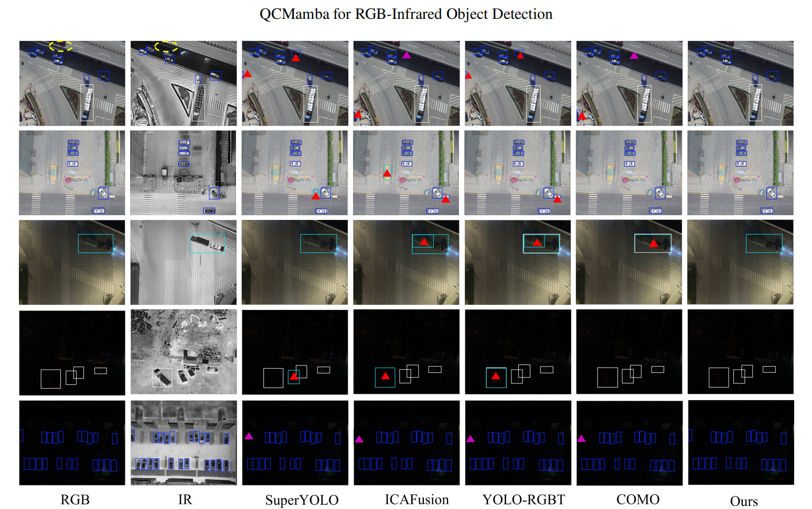

# QCMamba: Quality-Aware Cross-Modal Mamba-Attention Fusion for RGB-Infrared Object Detection

  
  
  
  

The complete code, dataset configuration files, and pre-trained weights will be released here upon paper acceptance or shortly after code cleanup. **Please Watch and Star this repository for updates! **

---

Multispectral object detection leveraging paired visible (RGB) and infrared (IR) imagery is crucial for robust perception across diverse environmental conditions. However, indiscriminate integration of cross-modal features often introduces significant noise when one modality is degraded (e.g., RGB images in low light, or IR images corrupted by thermal crossover). 

To address this challenge, we propose **QCMamba**, a plug-and-play fusion module seamlessly integrated into a dual-stream YOLO backbone. Our central innovation is the establishment of a **cascaded quality-guidance framework**, which dynamically propagates adaptive weights throughout the entire fusion process to assess modality reliability. 

  
   
  <em>Figure 1: Overall architecture of the proposed dual-stream multispectral detection framework with QCMamba fusion.</em>

  
   
  <em>Figure 2: Feature activation heatmaps with and without QRG. The RGB modality is assigned a higher weight in well-lit scenarios (left), whereas the IR modality dominates in low-light conditions (right). White ovals highlight areas of significant cross-modal calibration.</em>

